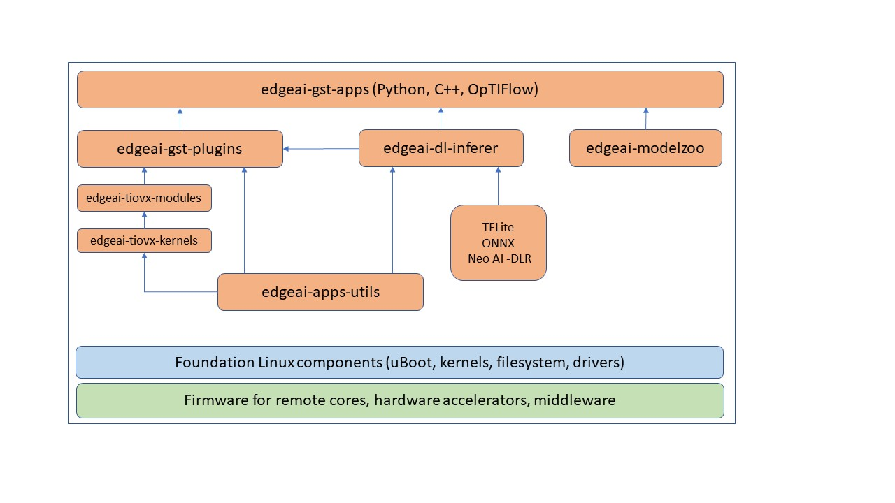

# Edge AI App Stack

Repository to assist Edge AI application development on PC by supporting
cross-compile Edge AI repos and installing them on target

# Getting Started

1. Clone the edgeai-app-stack on your PC

    `git clone https://github.com/TexasInstruments/edgeai-app-stack.git`

2. Get all the edge ai components using submodule init and update

    `git submodule init`

    `git submodule update`

3. Run setup script to install dependencies

    `./setup.sh $SOC`
    `Valid SOCs are j721e, j721s2, j784s4, j722s, am62a`

4. Connect the SD card that is flashed with EdgeAI WIC Image. By default
   TargetFS and Install Path is set as $(PWD)/targetfs

5. Modify Makefile to set TARGETFS, SOC, INSTALL_PATH etc..

6. Build and Install the components

    `make`

    `make install`

7. Run `make help` to know the differnet make targets available

# Sync to latest updates

1. Use below git command to sync to latest develop branch

    `git submodule update --recursive --remote`

2. Get the diff in all submodules

    `git diff --submodule=diff`

Edge AI app stack is validated on below devices, for more information please refer to the user guide links below

Device | Release Version | Link
--- | --- | ---
AM62A | 10.01.00 | [Processor SDK Linux for AM62Ax](https://software-dl.ti.com/processor-sdk-linux/esd/AM62AX/10_01_00/exports/edgeai-docs/common/sdk_components.html#edge-ai-application-stack)
AM67A | 10.01.00 | [Processor SDK Linux for AM67A](https://software-dl.ti.com/jacinto7/esd/processor-sdk-linux-am67a/10_01_00/exports/edgeai-docs/common/sdk_components.html#edge-ai-application-stack)
AM68A | 10.01.00 | [Processor SDK Linux for AM68A](https://software-dl.ti.com/jacinto7/esd/processor-sdk-linux-am68a/10_01_00/exports/edgeai-docs/common/sdk_components.html#edge-ai-application-stack)
AM69A | 10.01.00 | [Processor SDK Linux for AM69A](https://software-dl.ti.com/jacinto7/esd/processor-sdk-linux-am69a/10_01_00/exports/edgeai-docs/common/sdk_components.html#edge-ai-application-stack)
TDA4VM-SK | 10.01.00 | [Processor SDK Linux for SK-TDA4VM](https://software-dl.ti.com/jacinto7/esd/processor-sdk-linux-sk-tda4vm/10_01_00/exports/edgeai-docs/common/sdk_components.html#edge-ai-application-stack)
